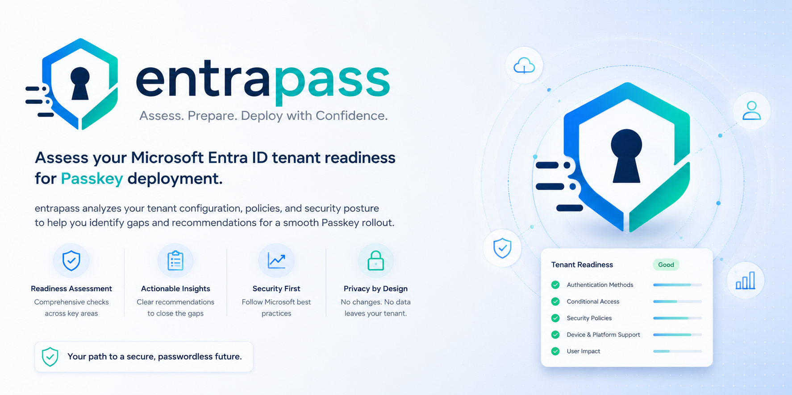
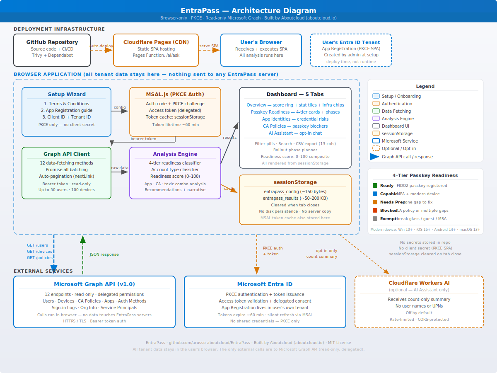
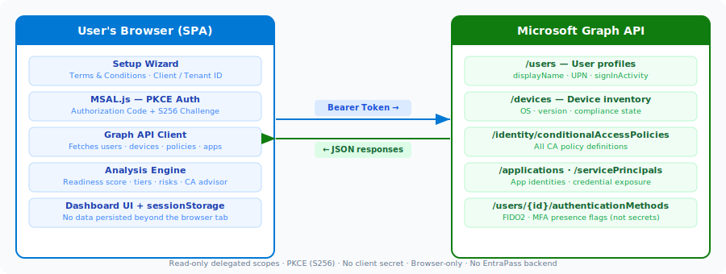

<p align="center">
  <a href="https://entrapass.aboutcloud.io">
    
  </a>
</p>

> **Assess your Microsoft Entra ID tenant's readiness for passkey (FIDO2) authentication.**
> Open source (MIT) · Browser-only · No data leaves your machine

[](https://entrapass.aboutcloud.io)
[](https://github.com/arusso-aboutcloud/EntraPass/actions/workflows/security-scan.yml)
[](https://github.com/arusso-aboutcloud/EntraPass/actions/workflows/deploy.yml)
[](LICENSE)
[](CONTRIBUTING.md)

---

## What is EntraPass?

EntraPass is a **client-side browser application** that scans a Microsoft Entra ID
tenant and tells you how ready it is for **passkey (FIDO2) authentication**. It
answers questions like:

- Which users can use passkeys right now, and which are blocked?
- Which users are "capable" and can self-register with no IT help?
- Which devices are running an OS too old for passkeys?
- Which Conditional Access policies block passkey registration?
- Which app identities expose credentials that could bypass passkeys?

It runs entirely in your browser. The only network calls it makes are to the
Microsoft Graph API — there is no EntraPass backend, no database, and no telemetry.

---

## ✨ Features

| Feature | Description |
|---|---|
| **4-Tier Passkey Readiness** | Classifies every user as Ready / Capable / Needs Prep / Blocked / Exempt — a precise picture of where each person stands (first 50 users on large tenants) |
| **Readiness Score (0–100)** | Composite score weighted by user tiers, FIDO2 policy state, TAP availability, CA gaps, and critical risk combinations (labelled as a sample score on tenants with more than 50 users) |
| **Rollout Phase Planner** | Automatically groups users into actionable deployment phases based on their tier (based on 50-user sample on large tenants) |
| **Per-User Recommended Actions** | Specific next step for each user — register passkey, enable MFA, update device OS, resolve CA blocker |
| **Device Compatibility** | Checks OS versions (Windows 10+, iOS 16+, Android 14+, macOS 13+) |
| **CA Policy Advisor** | Identifies Conditional Access policies blocking passkey registration |
| **Toxic Combination Detector** | Flags privileged users without MFA or passkey, and policies that allow password fallback |
| **App Identities** | Analysis of app registrations and service principals — password credentials, owner coverage, legacy-auth signals |
| **AI Assistant** | Optional AI chat (Cloudflare Workers AI or bring-your-own-key) to interpret results |
| **Executive Summary** | Prioritized recommendations plus infrastructure health chips |
| **Security First** | PKCE auth, your own app registration, browser-only data |

### What it does **not** do

- **No write access** — read-only Microsoft Graph scopes only
- **No data storage** — everything stays in your browser's `sessionStorage`
- **No scan-data egress** — tenant data, scan results, UPNs, group names, and Conditional Access policy contents never leave the browser (the only exception is the optional AI Assistant). The site uses self-hosted Umami for anonymous page-visit counts only; Umami never sees any Microsoft Graph response
- **No server** — zero backend, just static files on a CDN

---

## 🏗️ Architecture



### High-level flow



See the full [Architecture Document](docs/architecture.md) and
[Data Architecture](docs/data-architecture.md) for details.

---

## ⚡ Quick Start

### 1. Open the portal

Go to **[entrapass.aboutcloud.io](https://entrapass.aboutcloud.io)** (or your self-hosted URL).

### 2. Accept the Terms & Conditions

Read and acknowledge the T&C — this is required before proceeding.

### 3. Create an App Registration in **your** tenant

The scanner needs an App Registration (a **PKCE-only SPA**, no client secret) in
your Microsoft Entra ID tenant. The setup wizard offers three ways to create it:

| Method | Best for |
|---|---|
| **Azure Portal blade** (recommended) | Most users — the wizard links straight to the registration blade |
| **Azure Cloud Shell script** | Fastest — one command creates the app and all 7 permissions |
| **Manual PowerShell** | Advanced users who want full control |

See the [Installation Guide](docs/installation.md) for step-by-step instructions
for each method.

> **Note:** The Bicep template (`infra/app-registration.bicep`) is kept for
> reference only — `Microsoft.Graph/applications` Bicep deployment is not
> reliably supported, so use one of the three methods above instead.

### 4. Configure & sign in

Enter your **Client ID** and **Tenant ID** from the deployment, then sign in with
Microsoft and consent to the requested permissions.

### 5. Scan your tenant

Click **Scan Tenant Now** — all analysis happens in your browser.

### 6. Review & act

| Tab | What to look for |
|---|---|
| **Overview** | Animated readiness score, stat tiles, infrastructure health, executive summary |
| **Passkey Readiness** | Per-user cards with 4-tier status, filter pills, phase planner |
| **App Identities** | App registration risks — password credentials, owner gaps, legacy signals |
| **CA Policies** | Conditional Access policies blocking passkeys |
| **AI Assistant** | Ask questions about your results (opt-in) |

### 7. Clean up (optional)

```powershell
.\infra\cleanup-entrapass.ps1 -ClientId "<your-client-id>" -RevokeConsent
```

---

## 📚 Documentation

| Document | Description |
|---|---|
| [Architecture (HLD + LLD)](docs/architecture.md) | System architecture, components, flows |
| [Data Architecture](docs/data-architecture.md) | Data at each step, classification, lifecycle |
| [User Manual](docs/user-manual.md) | Full user guide with dashboard walkthrough |
| [Installation Guide](docs/installation.md) | Hosting, local dev, app registration, verification |
| [FAQ](docs/FAQ.md) | Frequently asked questions |
| [Contributing](CONTRIBUTING.md) | How to contribute |

---

## 🛡️ Security Scanning

The repository runs automated security scanning on every push and weekly:

| Scan | What it checks | Trigger |
|---|---|---|
| **Trivy — filesystem** | Vulnerabilities, secrets, misconfigurations | Push, PR, weekly |
| **Trivy — npm dependencies** | CRITICAL & HIGH vulnerabilities | Push, PR, weekly |
| **Dependabot** | Supply-chain vulnerabilities | Weekly (npm) + monthly (GitHub Actions) |

Trivy results are uploaded as SARIF to the **GitHub Security → Code scanning** tab.
The workflow is defined in [`.github/workflows/security-scan.yml`](.github/workflows/security-scan.yml).

---

## 🧑‍💻 Development

### Prerequisites

- **Node.js 18+** (CI builds on Node 22)
- **npm 9+**
- A **modern browser** (Chrome, Edge, Firefox, Safari)
- An **Entra ID tenant** plus rights to create an App Registration

### Setup

```bash
# Clone
git clone https://github.com/arusso-aboutcloud/EntraPass.git
cd EntraPass

# Install dependencies
npm install

# Dev server with hot reload (http://localhost:5173)
npm run dev

# Production build → dist/
npm run build

# Preview the production build locally
npm run preview
```

### Project structure

```
index.html                 # SPA entry point: setup wizard + dashboard markup
vite.config.js             # Vite build configuration
wrangler.toml              # Cloudflare Pages / Workers configuration

src/
  main.js                  # Application orchestration: MSAL, scan, rendering
  graph.js                 # Microsoft Graph API client
  analyzer.js              # Analysis engine (readiness, apps, policies, risks, score)
  style.css                # UI styling

functions/
  ai/
    ask.js                 # Cloudflare Pages Function for the AI Assistant

infra/
  app-registration.bicep   # Bicep template (reference only — see note above)
  app-registration.json    # ARM JSON template (reference)
  deploy-entrapass.ps1     # Cloud Shell deployment script
  cleanup-entrapass.ps1    # App Registration cleanup script

.github/workflows/
  deploy.yml               # Cloudflare Pages deployment
  security-scan.yml        # Trivy security scanning

docs/
  architecture.md          # HLD + LLD
  data-architecture.md     # Data flow documentation
  installation.md          # Installation guide
  user-manual.md           # User manual
  FAQ.md                   # Frequently asked questions
  diagrams/
    architecture.svg       # Architecture diagram (animated SVG)
```

### Environment variables

| Variable | Required | Description |
|---|---|---|
| `VITE_CLIENT_ID` | Optional | Client ID — if set with `VITE_TENANT_ID`, skips the setup wizard |
| `VITE_TENANT_ID` | Optional | Tenant ID — if set with `VITE_CLIENT_ID`, skips the setup wizard |

Set them in a `.env` file (git-ignored) for local development, or as build-time
secrets in CI. When both are present the wizard is bypassed and the app goes
straight to sign-in.

---

## 🔐 Security model

- **PKCE (S256)** — authorization code flow with Proof Key for Code Exchange
- **No client secret** — SPA apps don't need one and can't store one securely
- **Your own tenant** — the App Registration lives in *your* tenant, not a shared one
- **Delegated permissions** — the app acts on behalf of the signed-in user
- **Read-only scopes** — no write operations against Graph
- **Browser-only data** — no servers, no databases, no scan-data analytics
- **No cookies** — `sessionStorage` only, cleared when the tab closes
- **Open source** — full transparency, build verifiable from source

### Required permissions (Microsoft Graph, delegated)

| Permission | Purpose |
|---|---|
| `User.Read` | Sign in and read the signed-in user's profile |
| `User.Read.All` | List all users in the tenant |
| `Device.Read.All` | List all devices and their OS versions |
| `Policy.Read.All` | Read Conditional Access and authentication-method policies |
| `Application.Read.All` | Read app registrations for the App Identities analysis |
| `AuditLog.Read.All` | Read sign-in activity (last sign-in time) |
| `Organization.Read.All` | Read the tenant display name and verified domains |

---

## 🤝 Contributing

Contributions are welcome — bug reports, documentation fixes, new analysis rules, and UI improvements are all appreciated.

**Quick start:**

```bash
git clone https://github.com/arusso-aboutcloud/EntraPass.git
cd EntraPass
npm install
npm run dev          # http://localhost:5173
```

**PR workflow:**

1. Fork the repo and create a feature branch from `main` (e.g. `fix/policy-parsing`)
2. Make your change — keep PRs focused, one logical change per PR
3. Verify it builds: `npm run build` must succeed
4. Test in the browser — confirm the affected flow works end-to-end
5. Open a PR against `main`; CI runs Trivy and the Cloudflare Pages build automatically

**Core contract (non-negotiable):** EntraPass is read-only and browser-only. No write operations against Microsoft Graph, no backend, no persistent storage beyond `sessionStorage`. PRs that change this will not be merged.

See [CONTRIBUTING.md](CONTRIBUTING.md) for the full coding guidelines and how to report security vulnerabilities privately.

---

## 📄 License

MIT License — see [LICENSE](LICENSE) for details.

> **Commercial use:** EntraPass is MIT-licensed and free to use. If you plan to
> use it as part of a commercial product or paid service, we kindly ask that you
> [reach out](https://aboutcloud.io) before doing so. See the LICENSE file for
> the full note.

---

## 💬 Support

- **Issues**: [GitHub Issues](https://github.com/arusso-aboutcloud/EntraPass/issues)
- **Discussions**: [GitHub Discussions](https://github.com/arusso-aboutcloud/EntraPass/discussions)
- **Security**: report vulnerabilities privately via GitHub Security Advisories

---

> Built by [Aboutcloud](https://aboutcloud.io) for the passkey community — because
> phishing-resistant authentication shouldn't be hard to adopt.
